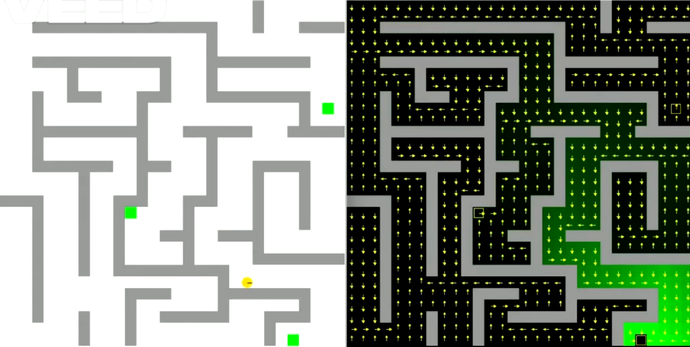

# 🤖 IASA – Agente Autónomo com Planeamento e Decisão Sequencial

> Projeto da unidade curricular **Inteligência Artificial para Sistemas Autónomos (IASA)**  
> Licenciatura em Engenharia Informática e Multimédia – **ISEL**  
> Ano letivo **2024 / 2025**

---

## 👤 Autor

- **Nome:** Miguel Cordeiro  
- **Número:** 49765  
- **Docente:** Luís Morgado  

---

## 📝 Descrição do Projeto

Este repositório reúne o trabalho desenvolvido no âmbito da unidade curricular **Inteligência Artificial para Sistemas Autónomos (IASA)**, focada no estudo e implementação de **agentes autónomos** com capacidades de **decisão, raciocínio e aprendizagem**, complementado com boas práticas de **Engenharia de Software**.

Ao longo de quatro partes, o projeto evolui de um agente puramente reativo até um agente deliberativo capaz de **planear, avaliar opções** e **tomar decisões sequenciais sob incerteza**, integrando conceitos como:

- arquiteturas **reativas**, **deliberativas** e **híbridas**  
- **procura em espaço de estados** (incluindo A* e Custo Uniforme)  
- **Processos de Decisão de Markov (PDM)**  
- noções de **aprendizagem por reforço** e decisão baseada em recompensas  

O resultado final é um agente que **observa**, **delibera**, **planeia** e **atua** num ambiente simulado, seguindo uma arquitetura modular e extensível.

---

## 🎯 Objetivos de Aprendizagem

- Implementar e comparar diferentes **arquiteturas de agente** (reativo vs deliberativo).  
- Aplicar técnicas de **Engenharia de Software**:  
  - abstração, modularização e fatorização  
  - uso de diagramas UML como base da implementação  
  - baixo acoplamento e alta coesão  
- Explorar **técnicas de procura**:
  - procura não informada (largura, profundidade, profundidade limitada, profundidade iterativa)  
  - procura informada (heurísticas, custo, A*, custo uniforme, greedy)  
- Construir agentes com:
  - **comportamentos reativos hierárquicos**, com ou sem memória  
  - **planeamento automático** em espaço de estados  
  - **decisão sequencial** com Processos de Decisão de Markov

---

## 🎥 Demonstração em Vídeo

[](media/demo.mp4)


---

## 🧠 Visão Geral da Arquitetura

A nível abstrato, o agente segue o ciclo clássico:

```mermaid
flowchart LR
    P[Perceção] --> C[Controlo]
    C --> A[Ação]
    A --> E[Ambiente]
    E --> P
